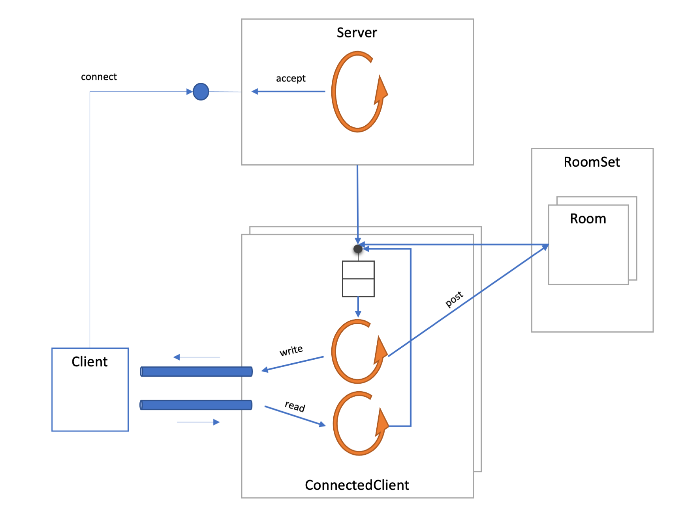

# Base implementation for the Winter 2021/2022 project

This repository contains a base implementation for the Winter 2021/2022 Concurrent Programming project.

* It contains multi-threading errors that must be fixed on the final implementation. 
Some of these errors are annotated with the `FIXME` comment.

* It contains some missing optional functionality, annotated with the `TODO` comments.

* This based implementation uses a _threads per connection_ design and also doesn't not take advantage of any thread pool.
The final implementation must replace this with an _asynchronous design_, namely:
    * Avoiding having a number of threads proportional to the number of connected clients.
    * Taking advantage of thread pools.
    
 For any question regarding this base implementation, please open an issue at [https://github.com/isel-leic-pc/s2122-1-se3/issues](https://github.com/isel-leic-pc/s2122-1-se3/issues).
 
 Be aware of any commits with corrections or improvements to this base implementation by looking at the [commit history](https://github.com/isel-leic-pc/s2122-1-se3/commits/main).

## Design aspects

This base implementation uses the following design:

* Each server instance has one thread to listen for new connections and creates a client instance for each.
Most of the time, this thread will be blocked waiting for a new connection.

* Each client instance uses two threads:
    - a _main thread_ that reads and processes control messages from a queue. These control messages can be:
        - A text message posted to a room where the client is present.
        - A text line sent by the remote connected client.
        - An indication that the read stream from the remote connected client ended.
        - An indication that the handling of the client should end (e.g. because the server is ending).
    - a _read thread_ that reads lines from the remote client connection and transform these into control messages sent to the main thread.
    
* Most interactions with the client are done by sending messages to the client control queue.

* The parsing of the remote client lines (commands or messages) is done by the `Line` class.

